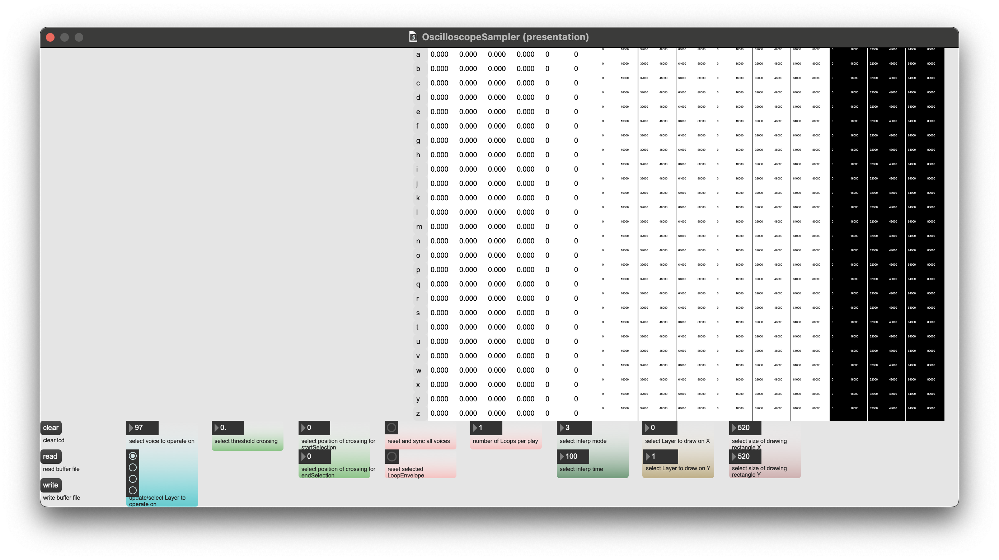

## **OscilloscopeSampler**

Short overview:
1st Column - volumeTime  
2nd Column - deductionTime  
3rd Column - minimalDeduction  
4th Column - maximalDeduction  
5th Column - selectionStart  
6th Column - selectionEnd  
7th Column - volumeEnvelope  
8th Column - deductionEnvelope  
9th Column - loopEnvelope  

volumeTime: 

NB:
1. Column - volumeTime
2. Column - deductionTime
3. Column - minimalDeduction
4. Column - maximalDeduction
5. Column - selectionStart
6. Column - selectionEnd
7. Column - volumeEnvelope
8. Column - deductionEnvelope
9. Column - loopEnvelope

CH: 0  
I: 0 - 25 volumeTime  
I: 26 - 51 deductionTime  
I: 52 - 77 minimalDeduction  
I: 78 - 103 maximalDeduction  
I: 104 - 129 selectionStart  
I: 130 - 155 selectionEnd  

I: 156 - 181 volumeTime  
I: 182 - 207 deductionTime  
I: 208 - 233 minimalDeduction  
I: 234 - 259 maximalDeduction  
I: 260 - 285 selectionStart  
I: 286 - 311 selectionEnd  

I: 312 - 337 volumeTime  
I: 338 - 363 deductionTime  
I: 364 - 389 minimalDeduction  
I: 390 - 415 maximalDeduction  
I: 416 - 441 selectionStart   
I: 442 - 467 selectionEnd  

I: 468 - 493 volumeTime  
I: 494 - 519 deductionTime  
I: 520 - 545 minimalDeduction  
I: 546 - 571 maximalDeduction  
I: 572 - 597 selectionStart  
I: 598 - 623 selectionEnd  

CH: 1 - 26 volumeEnvelope  
CH: 27 - 52 deductionEnvelope  
CH: 53 - 78 loopEnvelope  

CH: 79 - 104 volumeEnvelope  
CH: 105 - 130 deductionEnvelope  
CH: 131 - 156 loopEnvelope  

CH: 157 - 182 volumeEnvelope  
CH: 183 - 208 deductionEnvelope  
CH: 209 - 234 loopEnvelope  

CH: 235 - 260 volumeEnvelope  
CH: 261 - 286 deductionEnvelope  
CH: 287 - 312 loopEnvelope  
