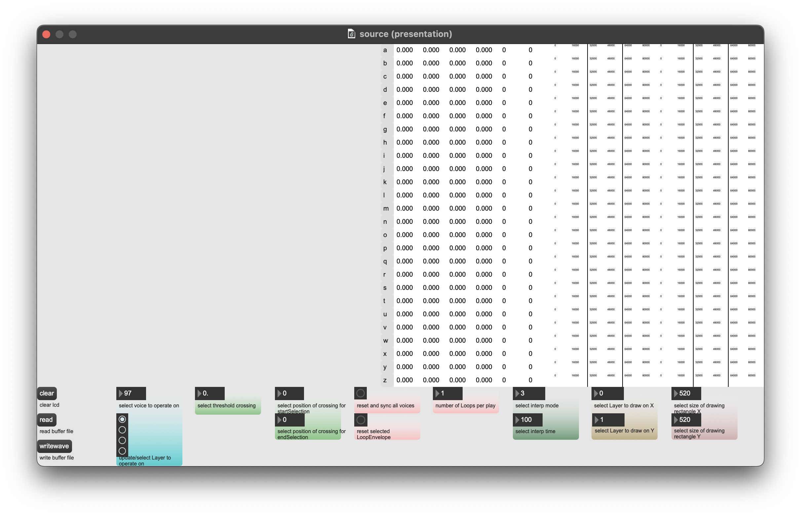

## **OscilloscopeSampler**

### **1. Short overview**  

Starting from the left side (C... Column):

1st C.: volumeTime  
2nd C.: deductionTime  
3rd C.: minimalDeduction  
4th C.: maximalDeduction  
5th C.: selectionStart  
6th C.: selectionEnd  
7th C.: volumeEnvelope  
8th C.: deductionEnvelope  
9th C.: loopEnvelope  

### **2. Parameters**

Starting from the left side, up to down:

clear: Clears the drawing area.
read: Imports chosen external audio file and reads it into Buffer. It is recomented to import audio files based on [these rules](#x.-Schtzngrm).
write: Export Buffer to a external destination.
number: select voice to opterate on
radiogroup: update/select Layer to operate on
number: select threshold crossing
number: select position of crossing for startSelection
number: select position of crossing for endSelection
button: reset and sync all voices
button: reset selected LoopEnvelope
number: number of Loops per play
number: select interp mode
number: select interp time
number: select Layer to draw on X
number: select Layer to draw on Y
number: select size of drawing rectangle X
number: select size of drawing rectangle Y

### **X. Schtzngrm**

This is the organisation of the Buffer "schtzngrm" (Ch... Channel, I... Index):

**Ch**: 0  
**I**: 0 - 25 volumeTime  
**I**: 26 - 51 deductionTime  
**I**: 52 - 77 minimalDeduction  
**I**: 78 - 103 maximalDeduction  
**I**: 104 - 129 selectionStart  
**I**: 130 - 155 selectionEnd  

**I**: 156 - 181 volumeTime  
**I**: 182 - 207 deductionTime  
**I**: 208 - 233 minimalDeduction  
**I**: 234 - 259 maximalDeduction  
**I**: 260 - 285 selectionStart  
**I**: 286 - 311 selectionEnd  

**I**: 312 - 337 volumeTime  
**I**: 338 - 363 deductionTime  
**I**: 364 - 389 minimalDeduction  
**I**: 390 - 415 maximalDeduction  
**I**: 416 - 441 selectionStart   
**I**: 442 - 467 selectionEnd  

**I**: 468 - 493 volumeTime  
**I**: 494 - 519 deductionTime  
**I**: 520 - 545 minimalDeduction  
**I**: 546 - 571 maximalDeduction  
**I**: 572 - 597 selectionStart  
**I**: 598 - 623 selectionEnd  

**Ch**: 1 - 26 volumeEnvelope  
**Ch**: 27 - 52 deductionEnvelope  
**Ch**: 53 - 78 loopEnvelope  

**Ch**: 79 - 104 volumeEnvelope  
**Ch**: 105 - 130 deductionEnvelope  
**Ch**: 131 - 156 loopEnvelope  

**Ch**: 157 - 182 volumeEnvelope  
**Ch**: 183 - 208 deductionEnvelope  
**Ch**: 209 - 234 loopEnvelope  

**Ch**: 235 - 260 volumeEnvelope  
**Ch**: 261 - 286 deductionEnvelope  
**Ch**: 287 - 312 loopEnvelope  
